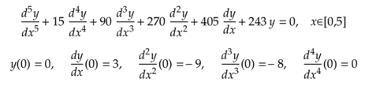
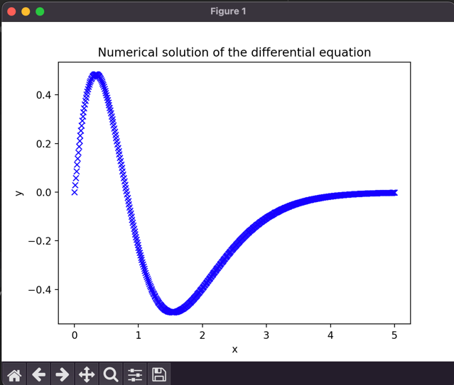
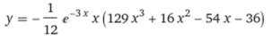
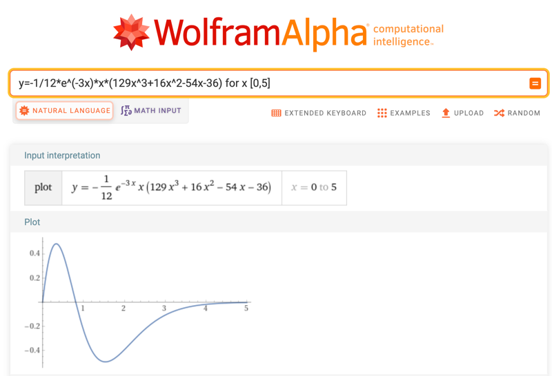
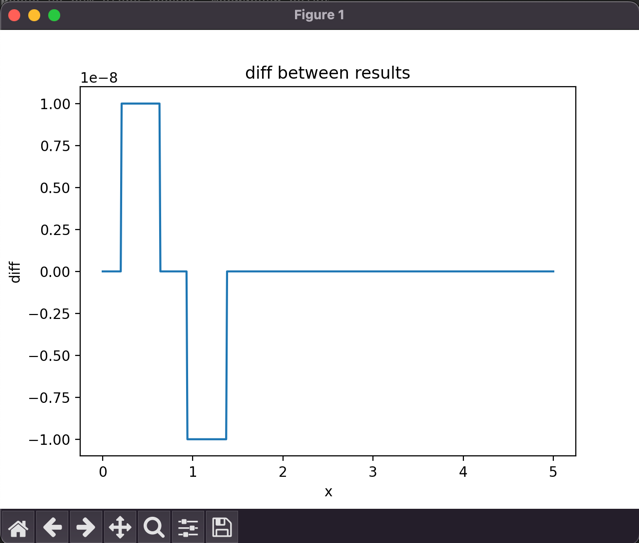

# Численное решение дифференциального уравнения

### этот проект решает задачу Коши для дифференциального уравнения:

для нахождения численного решения была использована схема Рунге-Кутты.  
Шаг сетки 0.01

# Решение

схема Рунге-Кутты реализована в файле *solution.py*  
результатом выполнения кода является графическое представление полученного решения:

Но насколько точно данное решение?  
Для оценки точности полученных результатов было использовано аналитическое решение уравнения 

Если построить график аналитического решения, то можно обратить внимание на схожесть численного и аналитического решений

> график аналитического решения  
> 

> график численного решения  
> 
> 
Проведем более точное сравнение.

# Оценка точности численного и аналитического решений

для оценки точности была использована разность между значениями функций в узлах сетки (*файл approximation.py*)

результатом функции, которая вычисляет разницу между значениями функций, является список значений этой разности.
построим график этой разности:

С учетом масштаба системы координат можно утверждать, что решения совпадают в точности до 10^-8